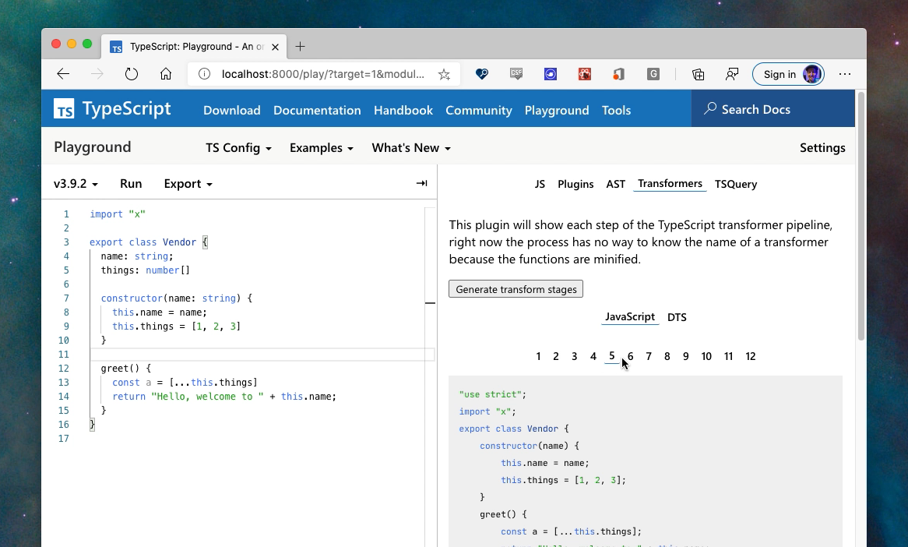

## TypeScript Transformers Playground Plugin

Lets you see each stage of the transform process for a TypeScript JS + DTS emit as a timeline.

<p align="center"></p>

## Running this plugin

- [Click this link](https://typescriptlang.org/play?install-plugin=playground-transformer-timeline) to install

or

- Open up the TypeScript Playground
- Go the "Plugins" in the sidebar
- Look for "Plugins from npm"
- Add "playground-transformer-timeline"
- Reload the browser

Then it will show up as a tab in the sidebar.

## Contributing

See [CONTRIBUTING.md](./CONTRIBUTING.md) for the full details, however, TLDR:

```sh
git clone ...
yarn install
yarn start
```

Then tick the box for starting plugin development inside the TypeScript Playground.
